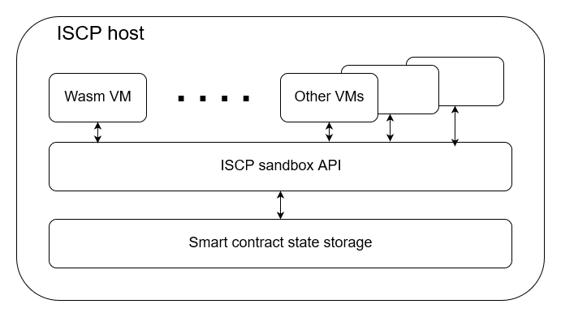
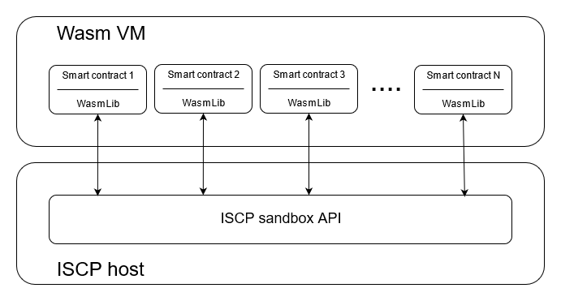

# Smart Contracts Schemas for ISCP

The Iota Smart Contracts Protocol (ISCP) provides us with a very flexible way of
programming smart contracts. It does this by providing an API to a sandboxed environment
that allows you to interact with the ISCP deterministically without any security risks.
The API provides a generic way to store, access, and modify the state of the smart
contract. The API can be used by any kind of Virtual Machine (VM) to implement a system to
program, load, and run smart contracts on top of the ISCP. The actual VMs can be
implemented by whomever wants to create them.

Of course, we are providing an example implementation of such a VM to allow anyone to get
a taste of what it is like to program a smart contract for the ISCP. Our VM implementation
uses [WebAssembly](https://webassembly.org/) (Wasm) code as an intermediate compilation
target. The implementation of the Wasm VM currently uses the open
source [Wasmtime](https://wasmtime.dev/) runtime environment. This enables dynamically
loading and running of the Wasm code.

We chose Wasm to be able to program smart contracts from any language. Since more and more
languages are becoming capable of generating the intermediate Wasm code this will
eventually allow developers to choose a language they are familiar with.

Because each Wasm code unit runs in its own memory space and cannot access anything
outside that memory by design, Wasm code is ideally suited for secure smart contracts. The
Wasm runtime system will only provide access to external functionality that is needed for
the smart contract to be able to do their thing, but nothing more. In our case all we do
is provide access to the ISCP host's sandbox API environment. The way we do that is by
providing a simple library that can be linked into the Wasm code. This library, for
obvious reasons, has been named `WasmLib` for now.

As you can see we can have any number of smart contracts running in our Wasm VM. Each
smart contract is a separately compiled Wasm code unit that contains its own copy of
WasmLib embedded into it. Each WasmLib provides the ISCP sandbox functionality to its
corresponding smart contract and knows how to access the underlying smart contract state
storage through the VM runtime system. This makes ISCP sandbox API access seamless to the
smart contract by hiding the details of bridging the gap between the smart contract's
memory space, and the ISCP host's memory space. It also prevents the smart contract from
accessing and/or modifying the ISCP host's memory space directly.

The ISCP sandbox environment enables the following functionality:

- Access to smart contract metadata
- Access to parameter data for smart contract function calls
- Access to the smart contract state data
- A way to return result data to the caller of a smart contract function
- Access to tokens owned by the smart contract and ability to move them
- Ability to call other smart contract functions
- Access to logging functionality
- Access to a number of utility functions provided by the host

Our initial implementation of WasmLib has been created for the Rust programming language.
Rust had the most advanced and stable support for generating Wasm code at the time when we
started implementing our Wasm VM environment. In the meantime, we also have implemented a
fully functional TinyGo version.

Note that both implementations are implemented using only a very small common subset of
these languages. This keeps the coding style very similar, barring some syntactic
idiosyncrasies. The reason for this is that we wanted to make it as easy as possible for
anyone to start working with our smart contract system. If you have any previous
experience in any C-style language you should quickly feel comfortable writing smart
contracts in either language, without having to dive deeply into all aspects of the chosen
language.

Let's start by diving deeper into a concept that is central to WasmLib smart contract
programming: proxy objects.

Next: [Data Access Proxies](proxies.md)

